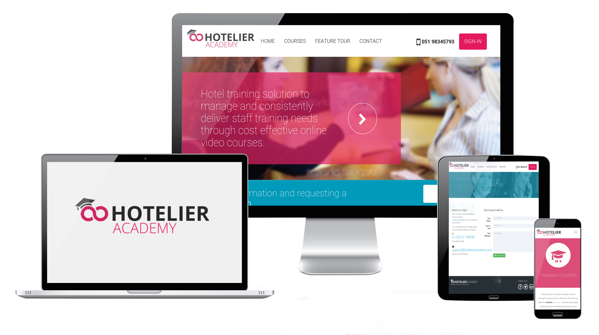
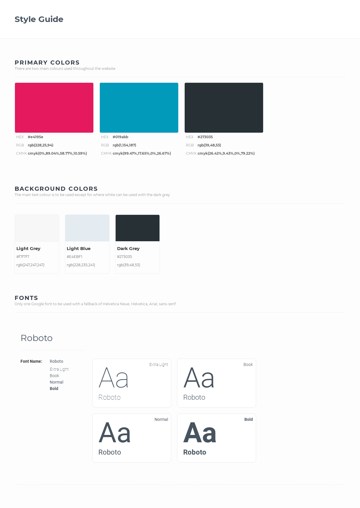

<h1 align="center">Code Institute Website</h1>

[View the live project here.](https://ukkpower.github.io/hotel/index.html)

This is the main website for the company Hotelier Academy. The purpose of this website is to market the business by explaining what the Hotelier Academy training platform is, the features and the benefits to the hotel industry.  The target audience is b2b users.

The design is a desktop first approach as that is the main device the target audience is using. However the website is fully responsive at its core and will be able to deliver its goals through any device.

The central design philosophy for the website is a text driven design with some complimentary images. The text is specifically laid out to be very easy to read and deliver its message quickly to the user. By using a text design the website by it nature will be fast loading.

<h2 align="center"></h2>

## User Experience (UX)

### User stories

    #### First Time Visitor Goals
    -   As a first time visitor I want to quickly understand what the Hotelier Academy training platform is so that I can see how it fits with my hotel.
    -   As a first time visitor I want to be able to see the list of features so that I can understand how it can replace my existing staff training setup.
    -   As a first time visitor I want to be able to understand the training courses available so that I can see the benefits to my business.
    -   As a first time visitor I want to be able to easily find the contact information so that I can get further information

    #### Returning Visitor Goals
    -   As a returning visitor I want to be able to navigate easily around the website so that I can find particular information that I was previously looking at.
    -   As a returning visitor I want to be able to easily find the contact information so that I can get further information

    #### Frequent User Goals
    -   As a Frequent User, I want to check to be able to log in to my training dashboard so that I can access my training material.

### Wireframes

    #### Concept Sketch
    -   Home Page - [View](https://github.com/)

    -   Features Page - [View](https://github.com/)
    
    -   Courses Page - [View](https://github.com/)

    -   Contact Us Page - [View](https://github.com/)

    #### Wireframes
    -   Home Page Wireframe - [View](https://github.com/)

    -   Features Page - [View](https://github.com/)
    
    -   Courses Page - [View](https://github.com/)

    -   Contact Us Page - [View](https://github.com/)

        #### Design
    -   Home Page - [View](https://github.com/)

    -   Features Page - [View](https://github.com/)
    
    -   Courses Page - [View](https://github.com/)

    -   Contact Us Page - [View](https://github.com/)

## Template
A template file is provided for the creation of further pages in the future. The template contains the essential html and css structure that has passed W3C standards. The template uses Bootstrap 4.

Included in the template.html: [View](https://github.com/)

-   HTML5 Structure

-   CSS3

-   Javascript

-   Header

-   Blank content section

-   Footer

## Design
<h2 align="center"></h2>

## Technologies Used

### Languages Used

-   [HTML5](https://en.wikipedia.org/wiki/HTML5)
-   [CSS3](https://en.wikipedia.org/wiki/Cascading_Style_Sheets)
-   [Javascript](https://en.wikipedia.org/wiki/Cascading_Style_Sheets)

### Frameworks, Libraries & Programs Used

1. [Bootstrap 4.4.1:](https://getbootstrap.com/docs/4.4/getting-started/introduction/)
    - Bootstrap was used to assist with the responsiveness and styling of the website.
1. [Google Fonts:](https://fonts.google.com/)
    - Google fonts were used to import the 'Titillium Web' font into the style.css file which is used on all pages throughout the project.
1. [Font Awesome:](https://fontawesome.com/)
    - Font Awesome was used on all pages throughout the website to add icons for aesthetic and UX purposes.
1. [jQuery:](https://jquery.com/)
    - jQuery came with Bootstrap to make the navbar responsive but was also used for the smooth scroll function in JavaScript.
1. [Git](https://git-scm.com/)
    - Git was used for version control by utilizing the Gitpod terminal to commit to Git and Push to GitHub.
1. [GitHub:](https://github.com/)
    - GitHub is used to store the projects code after being pushed from Git.
1. [Photoshop:](https://www.adobe.com/ie/products/photoshop.html)
    - Photoshop was used to create the logo, resizing images and editing photos for the website.
1. [MockFlow:](https://mockflow.com/)
    - MockFlow was used to create the wireframes during the design process.

## Testing

The W3C Markup Validator and W3C CSS Validator Services were used to validate every page of the project to ensure there were no syntax errors in the project.

-   [W3C Markup Validator](https://jigsaw.w3.org/css-validator/#validate_by_input) - [Results](https://github.com/)
-   [W3C CSS Validator](https://jigsaw.w3.org/css-validator/#validate_by_input) - [Results](https://github.com/)

The website has been tested on multiple device to ensure it is fully responsive.

Lighthouse in Chrome DevTools was used to test performance and accesibility

### Testing User Stories from User Experience (UX) Section

First Time Visitor

-   As a first time visitor I want to quickly understand what the Hotelier Academy training platform is so that I can see how it fits with my hotel.

--   Above the fold is a brief text introduction on what the website is about. 

--   The next section is a detailed explanation where the text is laid out in a inviting manner.

--   The bottom section contains the main benefits of the platform

-   As a first time visitor I want to be able to see the list of features so that I can understand how it can replace my existing staff training setup.

--   There is an entire page dedicated to demonstrating the list of features.

--   This page is made very easy to see the features point by point.

--   This page is very easy to navigate from anywhere on the website.

-   As a first time visitor I want to be able to understand the training courses available so that I can see the benefits to my business.

--   There is an entire page dedicated to demonstrating the list of courses.

--   This page is made very easy to see the courses point by point.

--   This page is very easy to navigate from anywhere on the website.

-   As a first time visitor I want to be able to easily find the contact information so that I can get further information

--   In the main navigation there is a link to the contact us page with many options to make contact.

--   On the home page there is a call to action that is designed to stand out.

--   On the features and courses pages there is a contact form designed to be easy to fill in 

#### Returning Visitor Goals

-   As a returning visitor I want to be able to navigate easily around the website so that I can find particular information that I was previously looking at.

--   The navigation is in the expected position at the top and is clean and easy to read. The navigation is responsive and works very well on mobile devices

-   As a returning visitor I want to be able to easily find the contact information so that I can get further information

--   The contact us page is linked form every page on the website through the navigation

--   A contact form is available on all pages.

#### Frequent User Goals

-   As a Frequent User, I want to check to be able to log in to my training dashboard so that I can access my training material.

--   A sign in button is available from all pages through the main navigation

--   This button is set in the primary colour for full visibility.

### Further Testing

-   The Website was tested on all major browsers Google Chrome, Internet Explorer, Microsoft Edge and Safari.

-   The website was viewed on a variety of devices such as Desktop, Laptop, iPhone7, iPhone 8 & iPhoneX.

-   All links were fully tested using the tool https://www.deadlinkchecker.com/website-dead-link-checker.asp

-   Friends and family members were asked to review the site and documentation to point out any bugs and/or user experience issues. 

-   An issue and bug tracking form was created to capture and organise issues https://docs.google.com/forms/d/e/1FAIpQLSft8mJYTlqxVhtz-Ol0962CKCOQK691BjdwLPoy6QiQJ7W2mQ/viewform?usp=sf_link

### Known Bugs

-   On some mobile devices the Hero Image pushes the size of screen out more than any of the other content on the page.
    -   A white gap can be seen to the right of the footer and navigation bar as a result.
-   On Microsoft Edge and Internet Explorer Browsers, all links in Navbar are pushed upwards when hovering over them.

## Deployment

### GitHub Pages

The project was deployed to GitHub Pages using the following steps...

1. Log in to GitHub and locate the [GitHub Repository](https://github.com/)
2. At the top of the Repository (not top of page), locate the "Settings" Button on the menu.
    - Alternatively Click [Here](https://raw.githubusercontent.com/) for a GIF demonstrating the process starting from Step 2.
3. Scroll down the Settings page until you locate the "GitHub Pages" Section.
4. Under "Source", click the dropdown called "None" and select "Master Branch".
5. The page will automatically refresh.
6. Scroll back down through the page to locate the now published site [link](https://github.com) in the "GitHub Pages" section.

### Forking the GitHub Repository

By forking the GitHub Repository we make a copy of the original repository on our GitHub account to view and/or make changes without affecting the original repository by using the following steps...

1. Log in to GitHub and locate the [GitHub Repository](https://github.com/)
2. At the top of the Repository (not top of page) just above the "Settings" Button on the menu, locate the "Fork" Button.
3. You should now have a copy of the original repository in your GitHub account.

### Making a Local Clone

1. Log in to GitHub and locate the [GitHub Repository](https://github.com/)
2. Under the repository name, click "Clone or download".
3. To clone the repository using HTTPS, under "Clone with HTTPS", copy the link.
4. Open Git Bash
5. Change the current working directory to the location where you want the cloned directory to be made.
6. Type `git clone`, and then paste the URL you copied in Step 3.

```
$ git clone https://github.com/YOUR-USERNAME/YOUR-REPOSITORY
```

7. Press Enter. Your local clone will be created.

```
$ git clone https://github.com/YOUR-USERNAME/YOUR-REPOSITORY
> Cloning into `CI-Clone`...
> remote: Counting objects: 10, done.
> remote: Compressing objects: 100% (8/8), done.
> remove: Total 10 (delta 1), reused 10 (delta 1)
> Unpacking objects: 100% (10/10), done.
```

Click [Here](https://help.github.com/en/github/creating-cloning-and-archiving-repositories/cloning-a-repository#cloning-a-repository-to-github-desktop) to retrieve pictures for some of the buttons and more detailed explanations of the above process.

## Credits

### Code

-   The full-screen hero image code came from this [StackOverflow post](https://stackoverflow.com)

-   [Bootstrap4](https://getbootstrap.com/docs/4.4/getting-started/introduction/): Bootstrap Library used throughout the project mainly to make site responsive using the Bootstrap Grid System.

-   [MDN Web Docs](https://developer.mozilla.org/) : For Pattern Validation code. Code was modified to better fit my needs and to match an Irish phone number layout to ensure correct validation. Tutorial Found [Here](https://developer.mozilla.org/en-US/docs/Web/HTML/Element/input/tel#Pattern_validation)

### Content

-   All content was written by the developer.

-   Psychological properties of colours text in the README.md was found [here](http://www.colour-affects.co.uk/psychological-properties-of-colours)

### Media

-   All Images were created by the developer.

### Acknowledgements

-   My Mentor for continuous helpful feedback.

-   Tutor support at Code Institute for their support.